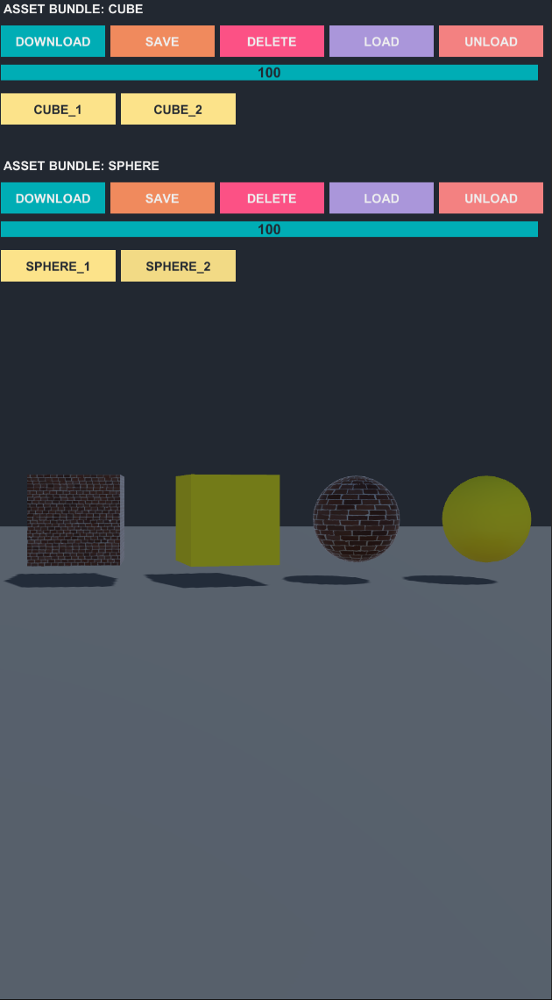
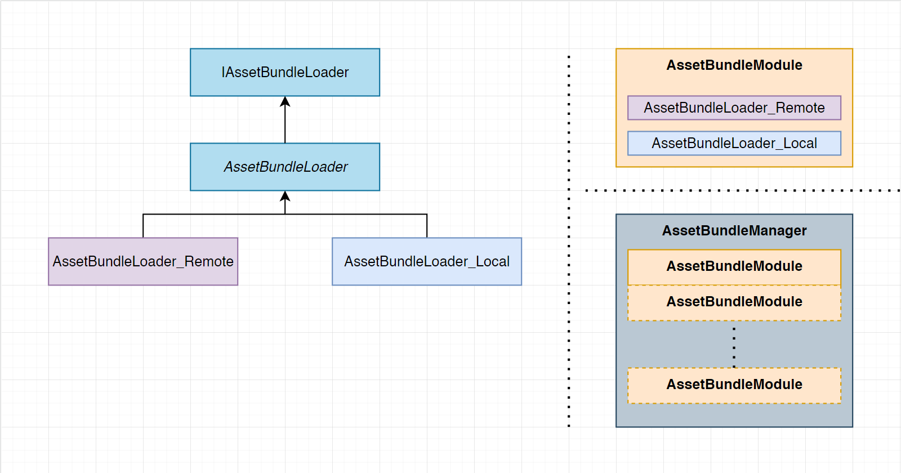

# Unity-AssetBundle-Library

This library is prepared to show how to use asset bundle system in unity.


**Dependencies**
- [Unity Asset Bundle Browser tool](https://github.com/Unity-Technologies/AssetBundles-Browser)
- [UniTask](https://github.com/Cysharp/UniTask)

---

**AssetBundleTest.cs** is the main test class. 

**Don't forget!**
You can find the code below inside the test class and you have to enter the valid remote location path. 

```c#
var cubeAssetBundleInfo = new AssetBundleInfo
{
    Name = AssetBundleName.Cubes,
    LocalLocation = Path.Combine(Application.persistentDataPath, "AssetBundles"),
    RemoteLocation = @"" // TODO: Set Remote Location Path
};

var sphereAssetBundleInfo = new AssetBundleInfo
{
    Name = AssetBundleName.Spheres,
    LocalLocation = Path.Combine(Application.persistentDataPath, "AssetBundles"),
    RemoteLocation = @"" // TODO: Set Remote Location Path
};
```

---

**Download:** Download the asset bundle from the remote location.

**Save:** Save the downloaded asset bundle to the local location. (Persistant Path)

**Delete:** Delete the saved asset bundle from the local location. (Persistant Path)

**Load:** Load the saved asset bundle from the local location to the memory.

**Unload:** UnLoad the loaded asset bundle from the memory.



---

This is the little architecture of the asset bundle codes.


